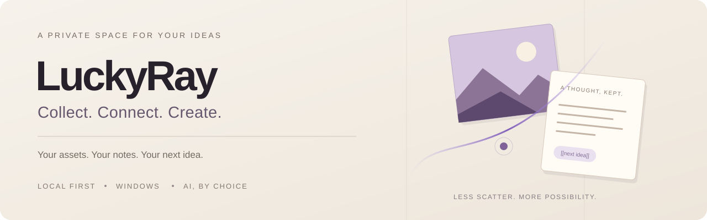

### 让收藏，成为创作的起点。

素材管理的秩序感 · 双向链接的知识网络 · 可以直接创作的 AI 画布

**[唯一官网 · luckyray.me](https://luckyray.me)** · [下载 Windows 版](https://luckyray.me/atelier/edition/download) · [浏览器插件](https://luckyray.me/atelier/edition/collector) · [使用文档](https://luckyray.me/atelier/edition/docs)

**简体中文** · [English](README.en.md)

## 好的参考，不该止步于收藏夹

浏览器里有参考图，文件夹里有素材，笔记里有想法。真正开始创作时，又要把它们重新找一遍。

**LuckyRay 把素材库、Markdown 知识库、关系图谱、画布与可选 AI 放进一个本地优先的 Windows 创作空间。** 从收集到整理，从理解到生成，让已有的积累继续参与下一次创作。

如果你喜欢 Eagle 式的素材整理，也习惯 Obsidian 式的链接思考，这里会有熟悉的工作习惯。LuckyRay 想进一步连接它们：让参考、笔记与创作在同一处接续。

> **收下一张图 → 记下一个想法 → 在画布里展开 → 把成果留回自己的资料库。**

## 一个空间，五种创作视角

| 视角 | 不只是存下来，更是用起来 |
| :--- | :--- |
| **素材库** | 用文件夹、标签与搜索整理图片、视频及创作文件。保留来源，导出原文件或 CSV 清单，让素材更容易找回。 |
| **知识库** | 用 Markdown 写下想法，通过双向链接、反向链接连接相关笔记。支持窗内分屏与布局管理，让阅读和整理更连贯。 |
| **关系图谱** | 从单篇笔记走向关联网络，换一个视角理解资料之间的联系。 |
| **Canvas 画布** | 把文字、图片与视频放在同一张画布上。配置模型后直接创作，使用参考包、创作模板、版本对比与图片精修；成果可保存到素材库或新建笔记。 |
| **LightSeek / LSH** | 连接你选择的模型服务，在授权范围内使用资料，辅助查找、理解与创作。AI 按需启用，核心整理不依赖模型服务。 |

### 从网页开始，也能接上这条工作流

配套 **LuckyRay Collector** 将 Edge / Chrome 中的文字、链接、图片与受支持的视频带回桌面。1.9.6 加入 **MP3/WAV 音频采集**，以及视频悬浮按钮的显示开关和快捷键。

[了解 Collector →](https://luckyray.me/atelier/edition/collector)

## 为你的下一次创作，留好起点

- **设计与视觉创作**：收集版式、色彩与图片参考，加入自己的笔记，在画布里组织方向、比较方案。
- **学习与研究**：把零散网页整理成 Markdown 笔记，用链接和图谱逐渐形成自己的知识网络。
- **AI 辅助创作**：让已有素材与文字参与创作，尝试不同模型与结果，再把值得保留的成果归档。

我们向优秀的素材管理与知识工具学习，同时专注一件事：**减少在工具之间搬运，让整理与创作自然衔接。**

## 从这里开始

**当前正式版：LuckyRay 1.9.6 + Collector 1.9.6** · 2026-10-11

| 你要做什么 | 入口 |
| :--- | :--- |
| **开始使用桌面端** | [官网下载页](https://luckyray.me/atelier/edition/download) · [直接下载 Windows x64 安装包](https://github.com/xiaorui2886/LuckyRay/releases/download/v1.9.6/LuckyRay_1.9.6_x64-setup.exe) |
| **安装或更新浏览器插件** | [Collector 安装说明](https://luckyray.me/atelier/edition/collector) · [直接下载扩展 ZIP](https://github.com/xiaorui2886/LuckyRay/releases/download/v1.9.6/LuckyRay-Collector-1.9.6.zip) |
| **查看这次改进了什么** | [新版更新说明](https://luckyray.me/atelier/edition/changelog) · [发行包与校验值](https://github.com/xiaorui2886/LuckyRay/releases/tag/v1.9.6) |

1. **打开桌面端**：适用于 Windows 10/11 x64。安装前阅读[安装与校验说明](docs/downloads.md)，重要资料保持独立备份。
2. **留下第一份参考**：导入一张图片，写一篇笔记，或在画布中整理一个小想法。
3. **按需扩展**：安装 Collector 接上浏览器；需要 AI 时，再配置自己的模型服务。

<strong>安装、平台与更新：使用前请看</strong>

- 当前桌面安装器未进行 Authenticode 签名。请核对官方 SHA-256，并保留发行说明中链接的第三方材料包与桌面组件补充包。
- Collector 是独立扩展包，需手动加载或更新；更新桌面端不会自动更新浏览器扩展。
- 应用内目前支持检查版本与下载安装包，完整自动更新尚未包含在本版。
- Android 仍在测试；macOS、Linux、iOS 尚未发布。不要把开发中的功能当作当前安装包能力。
- 网页采集受站点结构、访问权限和 DRM 等限制，并非所有网站和媒体都支持。

## 你的内容，你来决定

**本地优先，AI 可选。** 素材、Markdown 笔记与画布优先存放在本地或你选择的位置。使用远程模型、联网搜索或网页抓取时，相关内容可能发送给你选择的服务，服务商也可能单独收费。

[隐私与联网说明](PRIVACY.md) · [LightSeek 使用说明](docs/lightseek.md) · [数据与备份指南](https://luckyray.me/atelier/edition/docs)

## 一起把它打磨得更好

如果这个方向对你有用，欢迎点一下右上角 **Star**，方便下次找到，也让更多创作者看到 LuckyRay。

想接收新版提醒，可在 **Watch → Custom → Releases** 中订阅。一次具体的使用反馈，同样能帮助产品变好。

[报告问题 / 提出建议](https://github.com/xiaorui2886/LuckyRay/issues) · [贡献指南](CONTRIBUTING.md) · [安全问题报告](SECURITY.md)

### 为插件作者留一个入口

**Plugin SDK 1.0.0** 提供类型定义、创建/检查/打包工具，以及素材清单、配色、笔记提纲、画布导出四个教学示例。插件目录接受提交，目前尚无已上架的第三方条目。

[中文 SDK 指南](sdk/README.zh-CN.md) · [English SDK guide](sdk/README.md) · [兼容说明](docs/compatibility.md) · [提交插件](catalog/SUBMISSION.md)

---

**唯一官网：[https://luckyray.me](https://luckyray.me)**

这是 LuckyRay 的公开发布、文档与社区仓库，不包含桌面应用的完整源码。桌面应用可免费安装和使用，具体见[应用使用条款](LICENSE.md)；`sdk/` 采用 [MIT 许可证](sdk/LICENSE)。桌面应用、Collector 与第三方组件分别适用各自许可，详见[开源组件致谢](third-party/README.md)。

Eagle 与 Obsidian 是各自权利人的产品；此处仅描述工作习惯上的参考，不代表官方关联、完整兼容或功能对等。
